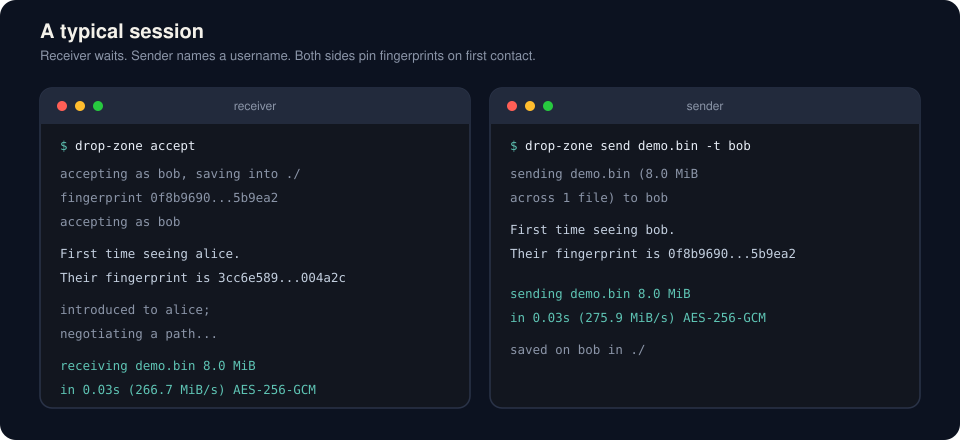
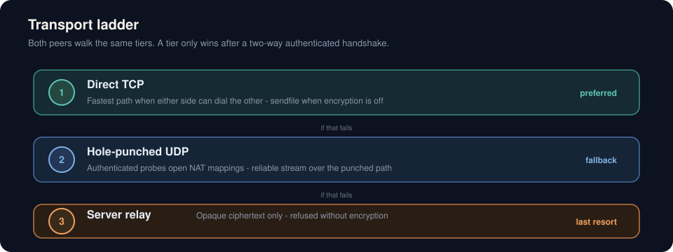
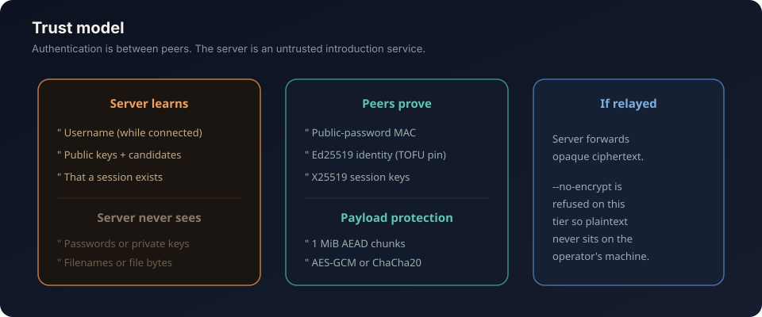
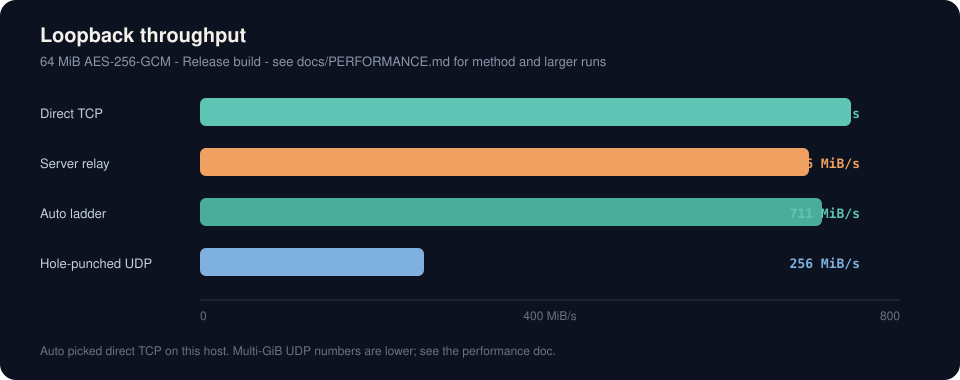

# drop-zone

Send files straight to another person's terminal, wherever they are.

<p align="center">
  
</p>

<p align="center">
  
</p>

A receiver runs `drop-zone accept`. A sender runs `drop-zone send report.pdf -t alice`. The two machines find each other through a rendezvous server that never sees a password, a filename or a file byte, then transfer the data on the best path they can open: a direct TCP connection, a hole-punched UDP stream, or — only if both of those fail — a relay of ciphertext through the server.

The client is C++20 and meant to be Homebrew-installable; the server is a separate, storage-free daemon an operator runs.

<p align="center">
  
</p>

## What you get

- **Direct by default.** Files go peer to peer. The server is a switchboard, not a store-and-forward box.
- **Three transports, one stream.** Direct TCP (including `sendfile` when encryption is off), reliable UDP over a hole punch, then server relay. `--force-transport` pins a tier for tests; otherwise both peers walk the same ladder.
- **Encryption that keeps up.** 1 MiB independently-nonced AEAD chunks, sealed in parallel. AES-256-GCM on CPUs with AES-NI (or FEAT_AES) and carry-less multiply; ChaCha20-Poly1305 otherwise. Chosen at run time, so one Homebrew bottle is fast on every machine it lands on.
- **Optional plaintext** with `--no-encrypt`, for a network you already trust. Refused on the relay: that path would put the file on the operator's machine.
- **No server storage.** Usernames live only while their owner is connected. Addresses live only in the kernel's socket state. Core dumps are disabled. Logs never name a peer, an address or a file.

<p align="center">
  
</p>

## Install the client

### From source

```sh
cmake -S . -B build -DCMAKE_BUILD_TYPE=Release -DDZ_BUILD_SERVER=OFF
cmake --build build --parallel
sudo cmake --install build
```

Needs a C++20 compiler, CMake 3.16+, and OpenSSL 1.1.1+ (3.x is fine). On Debian/Ubuntu that is `g++ cmake libssl-dev`.

### Homebrew

```sh
brew install DTYoda/tap/drop-zone
```

That taps [DTYoda/homebrew-tap](https://github.com/DTYoda/homebrew-tap) and trusts only this formula (Homebrew 7 requires that for third-party taps). The formula builds with `-DDZ_BUILD_SERVER=OFF`, so a `brew install` never places the daemon on a user's machine. To follow `main` instead of the latest tag: `brew install --HEAD DTYoda/tap/drop-zone`.

### First run

```sh
drop-zone setup
drop-zone accept                         # receiver; files land in ./
drop-zone send report.pdf -t alice       # sender
```

`setup` asks for a username, a private password (seals the identity keystore) and a public password (what senders type to prove they are allowed to reach you). Neither password is stored in the clear: the public password is sealed inside `identity.key` under the private password, so `accept` can reuse it. The official public rendezvous server (`129.153.161.241`) is used by default; change it later with `drop-zone set-server HOST[:PORT]`. Received files land in the current directory; change the default with `drop-zone set-output DIR`, or pass `-o DIR` on a single `accept`. Change the public password with `drop-zone set-public-password`, or pass `-p` on a single `accept`.

## Commands

| Command | What it does |
| --- | --- |
| `setup` | Create or update `~/.config/drop-zone/` |
| `accept` | Wait for incoming files |
| `accept --group=NAME` | Also join ephemeral group `NAME` (still reachable personally) |
| `send FILE... -t USER` | Send files or directories to a username |
| `send FILE... --group=NAME` | Send to everybody currently accepting in `NAME` |
| `whoami` | Print this machine's username and identity fingerprint |
| `status` | Print the configuration and which cipher this CPU will use |
| `set-output DIR` | Permanently change where received files are saved |
| `set-public-password` | Permanently change the public password senders use |
| `set-server HOST[:PORT]` | Permanently change the rendezvous server |

Useful flags, also listed in `drop-zone --help`:

- `-o DIR` / `-p PASSWORD` / `--yes` / `--once` / `--group=NAME` on accept
- `--group=NAME` on send (mutually exclusive with `-t`)
- `--no-encrypt` to skip payload encryption (refused on the relay)
- `--verify` to hash every file as well as authenticating the chunks
- `--force-transport=tcp\|udp\|relay` to skip the ladder
- `--server=HOST[:PORT]` and `--config-dir=DIR` for tests
- `-v` / `--verbose` to show TCP/UDP/relay attempts and other connection details
- `-q` / `--quiet` to only report problems

Passwords prompted on the terminal are not echoed. Passing `-p` on send puts the recipient's (or group's) public password in the shell history; omit it and drop-zone will ask. Passing `-p` on accept overrides your stored public password for that run only.

### Groups

A group exists only while at least one member is running `accept --group=NAME`. The first person to join sets the group password to their own public password; later joiners are prompted for it. `send --group=NAME` transfers to every member who is accepting at that moment — offline people are simply not in the group. Personal sends (`-t alice`) still work while someone is also in a group.

## How a transfer actually happens

1. The receiver claims its username on the rendezvous server and waits.
2. The sender asks to be introduced, attaching a MAC of the handshake transcript under a key stretched from the receiver's public password. A server that swapped the ephemeral keys to sit in the middle cannot forge that MAC.
3. Each peer pins the other's Ed25519 identity the first time it sees it, like SSH's `known_hosts`. A later session presenting a different key is refused.
4. Both peers try a direct TCP connection, then a UDP hole punch, then ask the server to relay. A tier only counts as succeeded once a two-way authenticated handshake has completed over it.
5. The sender offers a sealed manifest. The receiver confirms. File bytes then travel as 1 MiB chunks.

<p align="center">
  
</p>

The protocol, the residual risks, and measured throughput are in:

- [docs/PROTOCOL.md](docs/PROTOCOL.md)
- [docs/SECURITY.md](docs/SECURITY.md)
- [docs/PERFORMANCE.md](docs/PERFORMANCE.md)

<p align="center">
  
</p>

## Run the rendezvous server

```sh
cmake -S . -B build -DCMAKE_BUILD_TYPE=Release
cmake --build build --parallel
./build/bin/drop-zone-server --port 47654
```

`server/deploy/` has a systemd unit and a Dockerfile. The daemon writes nothing to disk, keeps no accounts, and will not log an address. `--no-relay` turns it into a pure introduction service.

Default port is **47654**. The official public server is **129.153.161.241**.

## Build and test

```sh
make                  # Release build in ./build
make test             # unit tests
make e2e              # loopback transfer across every transport tier
```

Two environment variables make a single-machine end-to-end run possible:

- `DROP_ZONE_HOME` — configuration directory, so two clients on one host do not share an identity.
- `DROP_ZONE_ALLOW_LOOPBACK` — put `127.0.0.1` in the candidate list. Pointless in real use; required for the loopback test.

Release builds use `-O3` and LTO when the toolchain supports it. `-march=native` is off by default (`-DDZ_NATIVE_ARCH=ON` to opt in): a Homebrew bottle compiled with AVX-512 would `SIGILL` on an older CPU, and every CPU-specific fast path is selected at run time instead.

## Layout

```
common/     framing, sockets, crypto, file I/O, CPU dispatch
client/     drop-zone: identity, transport ladder, data plane, CLI
server/     drop-zone-server: sharded event loop, claims, relay
tests/      unit tests and the loopback e2e script
docs/       protocol, security, performance, README images
packaging/  Homebrew formula, release checklist, and the client man page
```

## Configuration

Lives in `$DROP_ZONE_HOME`, else `$XDG_CONFIG_HOME/drop-zone`, else `~/.config/drop-zone`:

| File | Mode | Contents |
| --- | --- | --- |
| `config.toml` | 0600 | username, server, preferences. No secrets. |
| `identity.key` | 0600 | Ed25519 private key and public password, sealed with scrypt + AES-256-GCM (or ChaCha20-Poly1305) under the private password |
| `known_peers` | 0600 | TOFU pins, one username and fingerprint per line |

## License

MIT. See [LICENSE](LICENSE).
